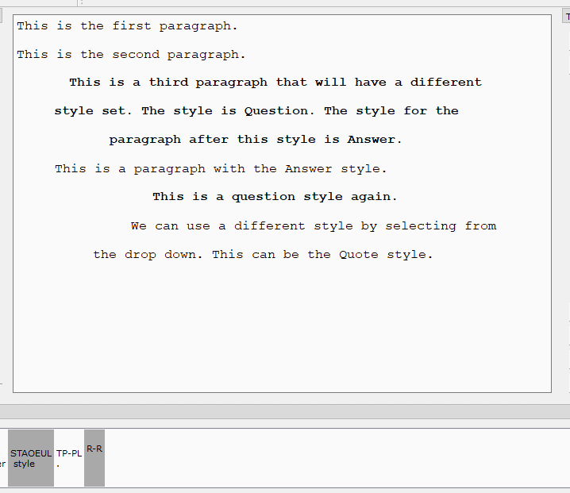

# How to perform a retroactive define

A `retroactive define` in the context of CAT software is when the user has written something, and then wishes to change the translation for the stroke throughout the document, hence `retroactive`. 

`Retroactive Define` is located under the `Steno Actions` menu and also on the toolbar.

Click and drag to select the text that should be defined. If no text is selected, nothing will be done. Then click `Retroactive Define`.

A dialog will appear. This dialog will display the steno underlying the selected text. There is a user-editable text box to enter the new translation. After entering the translation, click `OK` to confirm.

This new outline will be added to the transcript dictionary. The editor will search and replace all occurrences of the *selected text* in the document. The underlying steno will not be changed.

